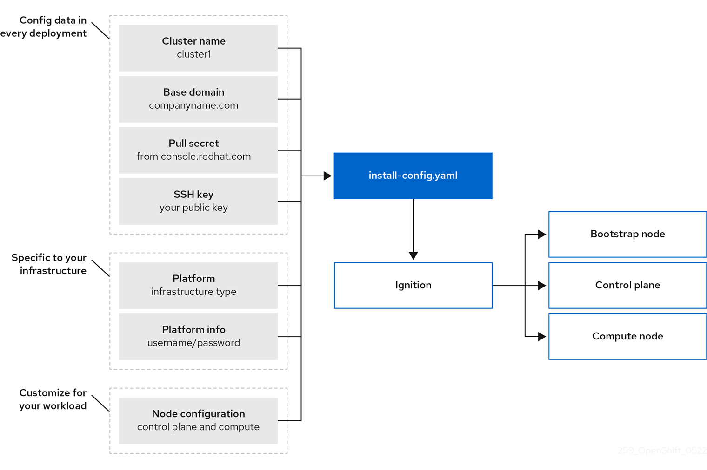
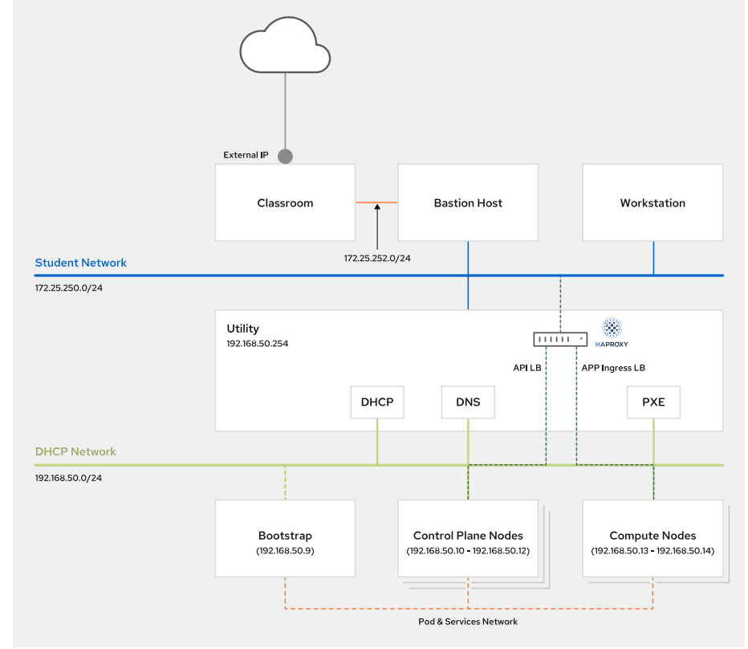

# ansible-vmware-okd-centos8

## Introduction

This guide is used to deploy a OCP4 cluster in baremetal, method manual. 
### References
    https://docs.okd.io/4.9/support/troubleshooting/troubleshooting-installations.html
    https://docs.openshift.com/container-platform/4.6/installing/installing_bare_metal/installing-bare-metal-network-customizations.html#installation-user-infra-machines-iso_installing-bare-metal-network-customizations
    OCP 4.6 DO322 - Red Hat OpenShift Installation Lab 

### Software version

| Software | Version |
| --- | --- |
| `openshift` | *4.6.1*, *4.10.26* |
| `rhcos` | *4.6.1*, *4.10.26* |

### Architect

Process of installation 

Diagram of system

### Description

Due to the guide use to test variety versions of OCP4 (eg:4.6.1, 4.10.26), we create a VM cluter for each OCP4 version with different name. 
For simple service setup (include DNS, haproxy, DHCP) we still use same IP address and MAC address for VM. vsphere environement allow to create VMs with differents name and same MAC. However we can only run 1 OCP4 cluster at once time. 

## Prepare

Get pull secret variables from at https://console.redhat.com/openshift/install/metal/installer-provisioned/, then copy into my_pull_secret: '{"auths":....}' in prepare_ocp_ignition.yml file

### Prepare vsphere environment

Put user login into: vars/vmw_env.yml
Put cluster VM info into: vars/<version>/vmw_vms.yml
Download iso file and put to ISO datastore, then VM var will point the cdrom to that iso image. 

    https://mirror.openshift.com/pub/openshift-v4/x86_64/dependencies/rhcos/4.6/4.6.1/rhcos-installer.x86_64.iso 
    https://mirror.openshift.com/pub/openshift-v4/x86_64/dependencies/rhcos/4.10/4.10.16/rhcos-live.x86_64.iso

### Prepare OCP4 
## Setup

### deploy cluster  

On deploy-1, provisioning VM cluster.
    
    ansible-galaxy collection install community.crypto
    git clone https://github.com/chuhakhanh/ansible-vmware-okd-centos8 
    cd /root/ansible-vmware-okd-centos8
  
Create a cluster: rhcos_version we can use is 4.6.1 or 4.10.16, action is create or destroy. 
  
    ansible-playbook -i config/inventory setup_vmware_cluster.yml -e "action=create" -e "rhcos_ver=4.10.16"
    echo "10.1.17.253 utility" >> /etc/hosts
    ssh-copy-id root@utility

Or delete the cluster
 
    ansible-playbook -i config/inventory setup_vmware_cluster.yml -e "action=destroy" -e "rhcos_ver=4.10.16"

Prepare environment such as local repository, hosts file    
    
    ansible-playbook -i config/inventory prepare_node_all.yml
    
### Setup the utility node    

Setup required software node utility such as: dns, dhcp ...
    
    ansible-playbook -i config/inventory prepare_node_utility_service.yml 

Prepare OCP4 resource for utility node. There are severals openshift version: rhcos_version we can use is 4.6.1 or 4.10.16 

    ansible-playbook -i config/inventory prepare_node_utility_ocp.yml -e "rhcos_ver=4.10.16"

### Setup VM in OCP cluster using Method ISO Installation

Createa ignition file

    ansible-playbook -i config/inventory prepare_ocp_ignition.yml -e "rhcos_ver=4.10.16"
    or
    ansible-playbook -i config/inventory prepare_ocp_ignition.yml -e "rhcos_ver=4.6.1"

Setup VM Installing a cluster on bare metal with network customizations - Installing on bare metal | Installing | OpenShift Container Platform 4.6
References: 
    
    https://docs.openshift.com/container-platform/4.6/installing/installing_bare_metal/installing-bare-metal-network-customizations.html#installation-user-infra-machines-iso_installing-bare-metal-network-customizations

    
On client node, after boot into iso cdrom, go to the node console. 
Set timezone for VM

    sudo timedatectl set-timezone Asia/Saigon

Run coreos-installer to install the OS. 
For bootstrap VM
    
    sudo coreos-installer install /dev/sda --insecure-ignition --ignition-url http://192.168.50.254:8080/openshift4/4.6.4/ignitions/bootstrap.ign 
    or
    sudo coreos-installer install /dev/sda --insecure-ignition --ignition-url http://192.168.50.254:8080/openshift4/4.10.26/ignitions/bootstrap.ign
    
For master VM
    
    sudo coreos-installer install /dev/sda --insecure-ignition --ignition-url http://192.168.50.254:8080/openshift4/4.6.4/ignitions/master.ign
    or 
    sudo coreos-installer install /dev/sda --insecure-ignition --ignition-url http://192.168.50.254:8080/openshift4/4.10.26/ignitions/master.ign

For worker VM

    sudo coreos-installer install /dev/sda --insecure-ignition --ignition-url http://192.168.50.254:8080/openshift4/4.6.4/ignitions/worker.ign 
    or
    sudo coreos-installer install /dev/sda --insecure-ignition --ignition-url http://192.168.50.254:8080/openshift4/4.10.26/ignitions/worker.ign 

Perform reboot to start the Bootstrap. Login to bootstrap and master node to verify installation process:

    rhcos_ver=4.10.16 or rhcos_ver=4.6.1
    rm -f /root/.ssh/known_hosts
    ssh -i /root/.ssh/"$rhcos_ver"/id_rsa core@bootstrap
    ssh -i /root/.ssh/"$rhcos_ver"/id_rsa core@master01
    watch 'ps -ef| grep -v "\["'
    
    export KUBECONFIG=/root/ocp4upi/"$rhcos_ver"/auth/kubeconfig

Troubleshooting while bootstraping:

    ssh core@bootstrap 
    journalctl -b -f -u release-image.service -u bootkube.service
    journalctl -b -f -u bootkube.service
    for pod in $(sudo podman ps -a -q); do sudo podman logs $pod; done

References: 

    https://docs.openshift.com/container-platform/4.6/post_installation_configuration/node-tasks.html

For clusters running on platforms that are not machine API enabled, such as bare metal and other user-provisioned infrastructure, you must implement a method of automatically approving the kubelet serving certificate requests (CSRs). [Review logss in logs/utility.log to review output from node utlity about bootstrap process](logs/utility.log)
Example:
After there are some error logs, and request pending. After approve all the request, all logs is cleared.
E0808 15:40:48.752187   58531 reflector.go:307] k8s.io/client-go/tools/watch/informerwatcher.go:146: Failed to watch *v1.ClusterVersion: the server is currently unable to handle the request (get clusterversions.config.openshift.io)
DEBUG Still waiting for the cluster to initialize: Cluster operator authentication is reporting a failure: WellKnownReadyControllerDegraded: need at least 3 kube-apiservers, got 2 

On node utility

    rhcos_ver=4.10.16
    export KUBECONFIG=/root/ocp4upi/"$rhcos_ver"/auth/kubeconfig
    openshift-install --dir=/root/ocp4upi/"$rhcos_ver" wait-for install-complete --log-level=debug
 
    oc get csr
    oc get csr -o go-template='{{range .items}}{{if not .status}}{{.metadata.name}}{{"\n"}}{{end}}{{end}}' | xargs --no-run-if-empty oc adm certificate approve
    oc get nodes
    oc get co

On haproxy

    http://10.1.17.253:32700/
### After install, login to OCP4

Edit hosts file

    10.1.17.253 console-openshift-console.apps.ocp4.example.com oauth-openshift.apps.ocp4.example.com

Login to console 

    https://console-openshift-console.apps.ocp4.example.com/monitoring/dashboards/grafana-dashboard-etcd
    user: kubeadmin
    password: cat /root/ocp4upi/"$rhcos_ver"/auth/kubeadmin-password

[Manage OCP cluster in docs/oc.md to manage](docs/ocp.md)

## Note: 

When we create a ignition file, we have to finish the installation with in 24 hours.Because the ignition files contains certificate and it will expires in 24 hours.
If you recreate OCP and recreate ignition file, remove hidden files: /root/ocp4ui/.openshift_install_state.json 